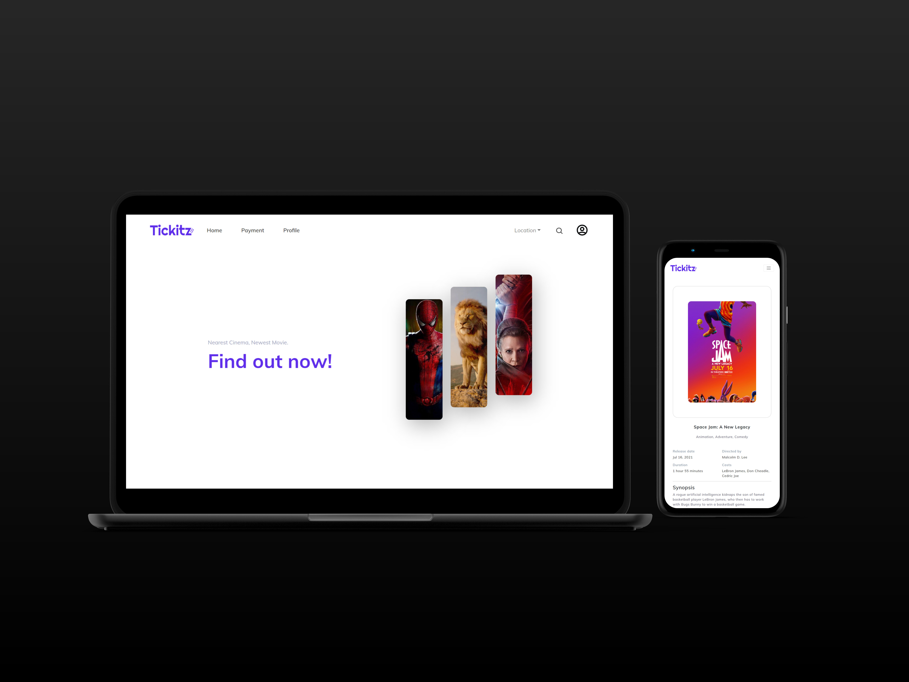

<h1 align='center'>React JS - Uvies - Online Ticket Booking</h1>
  <p align="center">
    <a href="https://uvies.netlify.app">View Demo</a>
    ·
    <a href="https://github.com/twicks95/uvies-react-app/issues">Report Bug</a>
    ·
    <a href="https://github.com/twicks95/uvies-react-app/pulls">Request Feature</a>
  </p>



## About The Project

The website application was created to help movie lovers to find out what films are currently showing and will be showing in the near future. It also provides the convenience of choosing a cinema, booking seats, and buying tickets online.

## Built With

[](https://github.com/facebook/react)
[](https://github.com/react-bootstrap/react-bootstrap)
[](https://github.com/react-bootstrap/react-bootstrap)
[](https://github.com/reduxjs/redux)

## Requirements

1. <a href="https://nodejs.org/en/download/">Node Js</a>
2. Node_modules `npm install` or `yarn install`
3. Uvies Backend API [`here`](https://github.com/twicks95/uvies-backend-RESTfull-API)

## Getting Started

1. Download this Project or you can type `git clone https://github.com/twicks95/uvies-react-app.git`
2. Open app's directory in CMD or Terminal
3. Type `npm install` or `yarn install`
4. Add .env file at root folder project

```
REACT_APP_API_BASE_URL= [Backend API]
REACT_APP_API_USER_IMG_URL= [Backend user image URL]
REACT_APP_API_MOVIE_POSTER_URL= [Backend movie poster URL]
```

5. Type `npm run serve`

## Acknowledgements

- [React](https://reactjs.org/)
- [React Bootstrap](https://react-bootstrap.github.io/)
- [Axios](https://www.npmjs.com/package/axios)
- [redux](https://redux.js.org/)
- [React Chart JS](https://github.com/reactchartjs/react-chartjs-2)
- [Hero Icons](https://github.com/tailwindlabs/heroicons)

## License

© [Teguh Wicaksono](https://github.com/twicks95)
